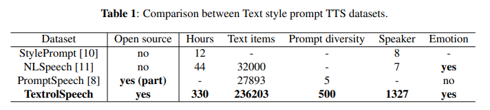
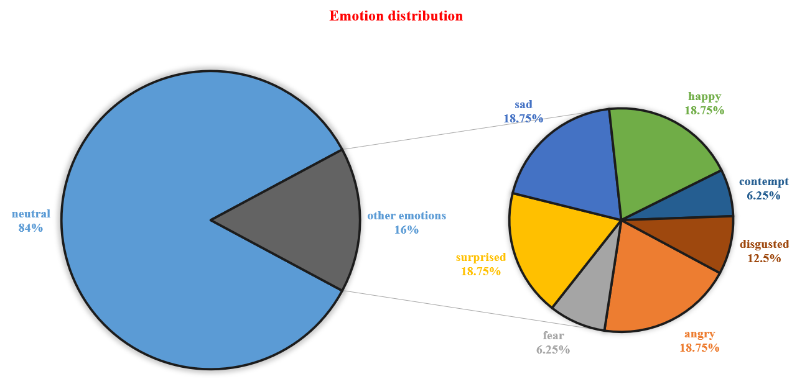

# Textrolspeech
The official repository of Textrolspeech (accepted by 2024 ICASSP)

[](https://ieeexplore.ieee.org/abstract/document/10445879)
[](https://sall-e.github.io/)

<br>

<br>

## 🔥 News
- *2024.06*: We release ControlSpeech on arxiv and opensource ControlToolkit.
- *2023.12*: [Textrolspeech](https://github.com/jishengpeng/TextrolSpeech) is accepted by ICASSP 2024.

## 🔥Tips
We have two versions available on the web, so keep an eye on the version that ends up in the ICASSP Conference Proceedings, not the arxiv version. We have further updated the details of the dataset and related experimental results in the ICASSP version. Moreover, we will release two papers based on textrolspeech before 2024 June and welcome you to continue to follow the textrolspeech series.

<br>

<br>

## How to get Textrolspeech
We provide the open-source download link for TextrolSpeech as follows:

### Speech:

1. https://drive.google.com/file/d/1kNjYBqv_DohG8N3wF-J7kCSBmLxvs77N/view?usp=drive_link
2. http://www.openslr.org/60/
3. https://datashare.ed.ac.uk/handle/10283/3443

### Text:

1. https://drive.google.com/file/d/1HN2KsDye_xwpqAMa7iYtQoO4oA3-Ndkv/view?usp=drive_link

### It is worth noting that:
- We have further updated the data for the tempo labels, primarily optimizing the duration boundaries during text and speech alignment.

- The speech samples in different sections of the original dataset have varying sampling rates. However, in Salle, we have standardized the sampling rate within the codec section.

- The neutral emotion section comprises 500 speech descriptions.

- If the emotion section is disregarded, there is greater potential for interaction between the text style and speech aspects through the dataset. For instance, a single speech sample can be transformed into 500 samples based on different style prompts.

- We randomly selected 200 samples for the test set, but it is possible to expand the number of test examples.

- The structure in the Val directory is: gender/emotion/gender;pitch;tempo;energy.txt


## Citations

If you use our Textrolspeech, please cite the following paper:

```bibtex
@inproceedings{ji2024textrolspeech,
  title={Textrolspeech: A text style control speech corpus with codec language text-to-speech models},
  author={Ji, Shengpeng and Zuo, Jialong and Fang, Minghui and Jiang, Ziyue and Chen, Feiyang and Duan, Xinyu and Huai, Baoxing and Zhao, Zhou},
  booktitle={ICASSP 2024-2024 IEEE International Conference on Acoustics, Speech and Signal Processing (ICASSP)},
  pages={10301--10305},
  year={2024},
  organization={IEEE}
}
```


